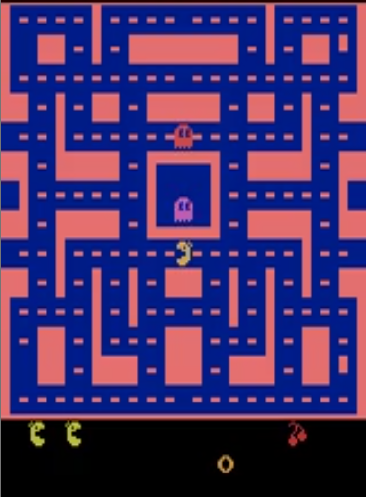
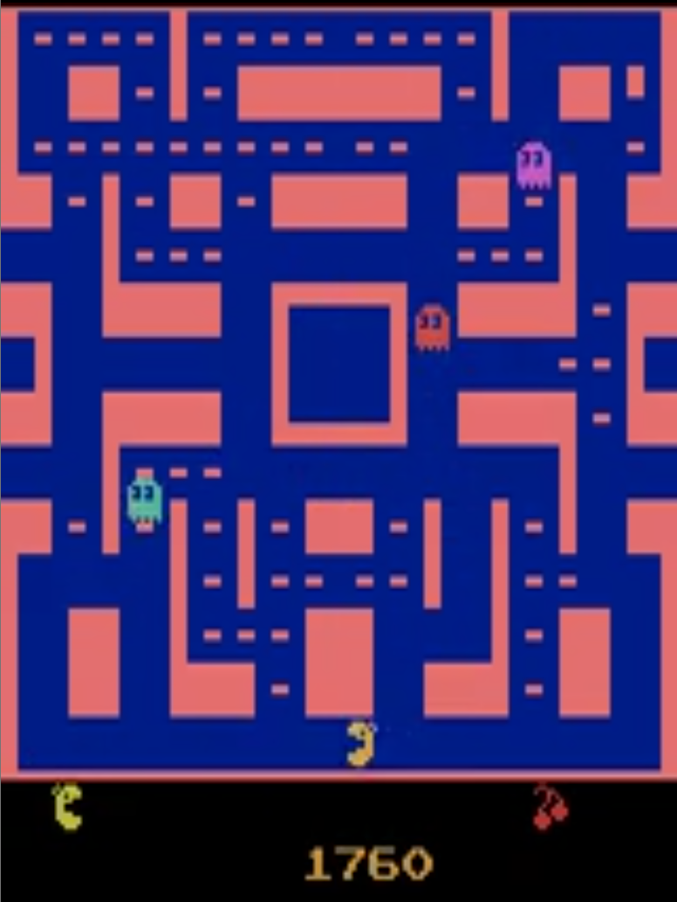

# MsPacman-Atari-Domain
MsPacman Domain using AI techniques to improve play

# Ms. Pac-Man Double + Dueling DQN

A Deep Reinforcement Learning project applying Double DQN and Dueling DQN techniques to the classic Atari game Ms. Pac-Man.
The goal of this project is to compare a baseline DQN agent with improved architectures and observe how gameplay performance evolves throughout training.

This work is adapted from the starter DQN implementation here:
🔗 Starter Code: https://github.com/everestso/summer25/blob/main/c166f25_02b_dqn_pong.ipynb

# Project Overview

This project implements three agents:

1. Baseline DQN

A convolutional neural network producing Q-values for each discrete action.

2. Double DQN

Reduces Q-value overestimation by separating action selection and action evaluation.

3. Dueling DQN

Splits the network into Value and Advantage streams for more stable and expressive learning.

The agents are trained on:

Environment: ALE/MsPacman-v5

Observation: 84×84 grayscale, stacked 4 frames

Action Space: 5 discrete Atari actions

Objective: Learn to navigate the maze, avoid ghosts, and maximize score

## DQN MsPacman Agent Evaluation

Watch how performance improves as training progresses:

| Stage                                    | Video |
|------------------------------------------|--------|
| **Early Training (random-ish behavior)** |  |
| **Late Training (learned behavior)**     |  |

